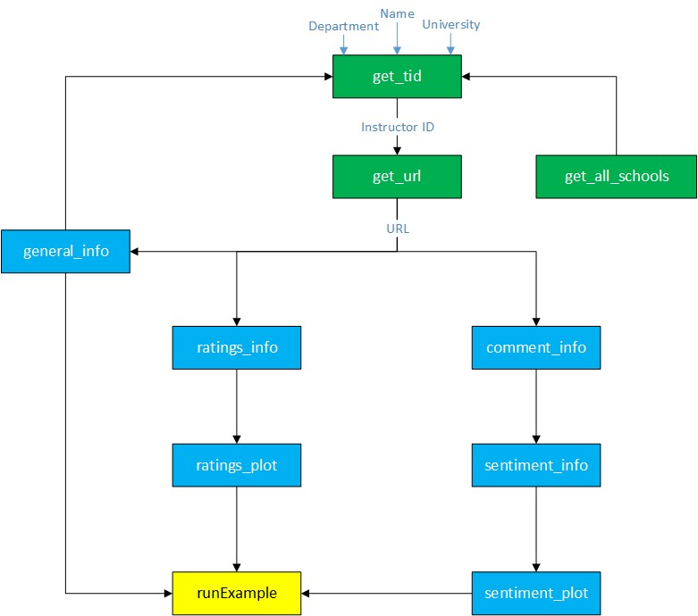

```{r, include = FALSE}
knitr::opts_chunk$set(
  collapse = TRUE,
  comment = "#>"
)
```

<br>
<br>

In the README file you learned HOW to use the package,
here, we get into the details of this package and its applications.


## Introduction
As a student you might be interested to know more about a specific instructor, the characteristics, difficulty of the course being taught by that professor, and the overall teaching quality.

This package makes a user-friendly UI to extract a summary of the information for an instructor of interest and visualizes them.


## What is this package for?    
This package addresses the following areas: <br>
  * What are the positive, negative aspects of an instructor?
  * What are the most frequent words used to describe an instructor?
  * How difficult are the courses taught by an instructor?
  * How is the overall teaching quality?
  * How the performance of an instructor has changed over time?
  * How do the grades of students affect the rating of an instructor?
  


## Who can use this package?
* Students: 
  * They can get more familiar with an instructor.
  * Find how other students experiences a course.
* TAs:
  * Self-evaluation
  * Tracking their progress over time (from student's point of view)
  * See how students feel about their TA-ship.
* Instructors:
  * Self-evaluation
  * Track the TAs' performances
  * Get to know their TAs (Strengths and Weaknesses) to provide constructive feedback.
  * Track their own progress over time
  * See how the course is perceived from students' point of view


## Installation
You can install this package from GitHub:

```{r eval=FALSE}
### install.packages("devtools")
devtools::install_github("m-fili/ProfRate")
```

Or download the `ProfRate` and install it locally using:

```{r eval=FALSE}
install.packages("file_path_to_target_package/ProfRate", repos=NULL, type="source")
```

Note that `file_path_to_target_package` is the placeholder and needs to be replace by the correct relative path on your machine.


<br>
## Background
The website that we used for this project is [RateMyProfessor](https://www.ratemyprofessors.com/). This website collects comments from students regarding the teaching quality, difficulty, and many more aspect of a course being taught by a specific professor. Our Package uses the information in this website to create a summary of teaching quality for an instructor of interest.


<br>
## Functions
First, we explain the flowchart of our functions and how they work with each other. This workflow is shown in the figure below:


```{r echo=FALSE, fig.cap="Flowchart of Functions", out.width="600px"}

```
<br>
As shown above, there are 10 functions overall in this package. The first three packages in green generates the URL to start the whole scraping procedure. The functions in blue rectangle, are the body of the package responsible for scraping, summarization, and visualization. The function at the bottom in yellow rectangle, is the Shiny app.

First a URL is generated using the name of the instructor, department name and the institution name. Then the comments and ratings are scraped from the webpage, and summarized and plotted. All the generated outputs then feed into the ShinyApp. In the follwoing the functions are explained in detail.\


### `get_all_schools`

* This functions generates a URL, given the name of an institution. 
* For this version of the package, it is not used, but for the future development it will be used for Campus Evaluation as well.

Examples:

```{r setup}
library(ProfRate)
```

```{r}
get_all_schools('Iowa State University')
```


```{r}
get_all_schools('MIT')
```


### `general_info`

* This function generates the general information for an instructor.
* It takes a URL and extract the instructor's name, department and university.
* It can be used independently, but it is used as a helper function to filter and find the instructor of interest in `get_tid` function.

Examples:

```{r}
general_info("https://www.ratemyprofessors.com/ShowRatings.jsp?tid=342455")
```

```{r}
general_info("https://www.ratemyprofessors.com/ShowRatings.jsp?tid=744853")
```


### `get_tid`

* This functions generates the URL given the information of the instructor.
* We can give only the name of the instructor as below:

```{r}
get_tid(name = 'Brakor')
```

* Or, we can give the name and department:

```{r}
get_tid(name = 'Brakor', department = 'Biology')
```

* We can also restrict the searches by specifying all infromation:

```{r}
get_tid(name = 'Brakor', department = 'Biology', university = 'Berkeley')
```


### `get_url`

* This function takes the same argument as `get_tid`, but generates the final URL. Under the hood it uses `get_tid` to first extract the `tid` number and then it generates the URL.

Examples:

```{r}
get_url(name = 'Brakor')
```

```{r}
get_url(name = 'Brakor', department = 'Biology', university = 'Berkeley')
```


### `comment_info`

* This function extracts the comments for a given URL.
* It separates the comments according to the year and course
* It also extracts the number of thumbs up and down for each comment.
* This function can filter the comments to be shown for those after a specific year.


```{r}
comment_info(url = "https://www.ratemyprofessors.com/ShowRatings.jsp?tid=1031282", y = 2000)
```

```{r}
comment_info(url = "https://www.ratemyprofessors.com/ShowRatings.jsp?tid=1129448", y = 2000)
```


### `sentiment_info`

* This function do sentiment analysis on the comments.
* It generates the set of _positive_, _negative_, and _tags_ for an instructor.
* It can filter the year ti include certain from a certain year up to present.

Example:

```{r}
sentiment_info(url = "https://www.ratemyprofessors.com/ShowRatings.jsp?tid=69792", y = 2009, word = 'Positive')
```

```{r}
sentiment_info(url = "https://www.ratemyprofessors.com/ShowRatings.jsp?tid=69792", y = 2000, word = 'Negative')
```


```{r}
sentiment_info(url = "https://www.ratemyprofessors.com/ShowRatings.jsp?tid=69792", y = 2009, word = 'Tags')
```


### sentiment_plot

* This functions visualizes the comments using word cloud.
* It can generate the _positive_, _negative_, and _tags_.
* It can filter the years to show the words in comments after a scpecific year.

Examples:

```{r}
sentiment_plot(url = "https://www.ratemyprofessors.com/ShowRatings.jsp?tid=69792", y = 2009, word = 'Positive')
```


```{r}
sentiment_plot(url = "https://www.ratemyprofessors.com/ShowRatings.jsp?tid=69792", y = 2000, word = 'negative')
```


```{r}
sentiment_plot(url = "https://www.ratemyprofessors.com/ShowRatings.jsp?tid=69792", y = 2000, word = 'Tags')
```


### `ratings_info`

* given the URL, it generate the rating info
* It creates three outputs:
  * number of comments
  * ratings table including the year, course, quality, difficulty, overall rating with some other info regarding the course or student who left that rating.
  * summary of ratings
  

Examples:

```{r}
ratings_info("https://www.ratemyprofessors.com/ShowRatings.jsp?tid=1129448", y=2009)
```


### `ratings_plot`

* given the URL, it generate the visualization for the ratings
* It creates four subplots:
  * Overall Rating
  * Average rating by course
  * Average rating by grade
  * Average rating by year
  
  
  
```{r}
ratings_plot("https://www.ratemyprofessors.com/ShowRatings.jsp?tid=1129448", y=2009)
```


## Testing
We included different tests for each function to make sure it is working properly. The coverage of the package is 98%, as the time of writing this report. Here are the set of things in general that is checked for each function:

* Checking the Data Type
* Verifying the Length of Inputs and Outputs
* Correct Format of the URL
* Correct set of Arguments
* Error Messages
* Checking plot producibility


## Documentation
Each function is documented thoroughly. The set of information included in each function is as below:

* Name and description
* Usage
* Arguments and their definition
* Outputs and their definition
* Examples


## Website
The [website](https://m-fili.github.io/ProfRate/) is launched and includes the references and other useful information on how to use this package.


## ShinyApp
In this package, there is a function named `runExample` that the user can utilize to show all the functionalities discussed so far through an interactive App.


## Future Steps

Here are the future steps to make this package more comprehensive.

1. Adding Campus Evaluation to the App

2. Incorporating correlation Analysis & outlier detection
  * Relation between the ratings and grades
  * Relation between the comments and grades

3. Incorporate likes and dislikes into analysis to emphasize on the valid comments.
