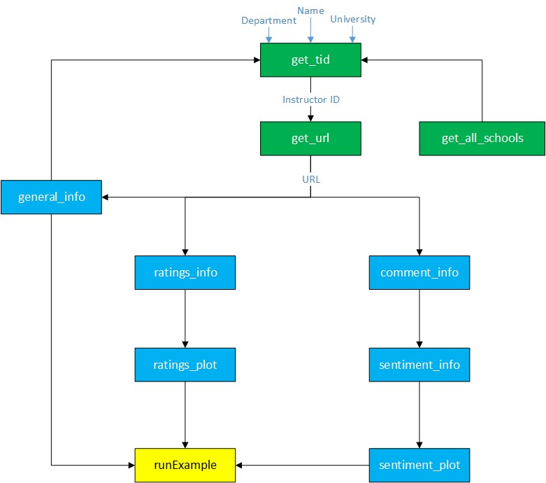
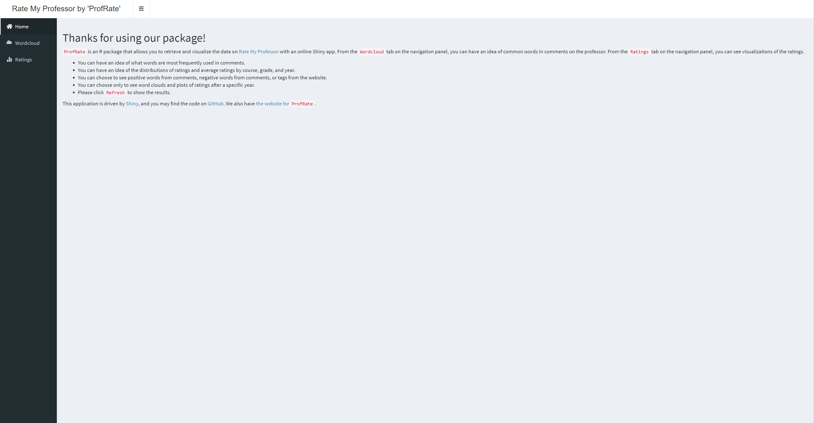
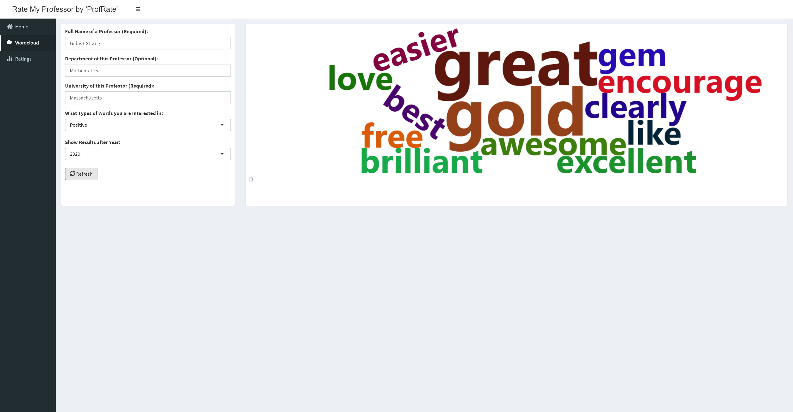
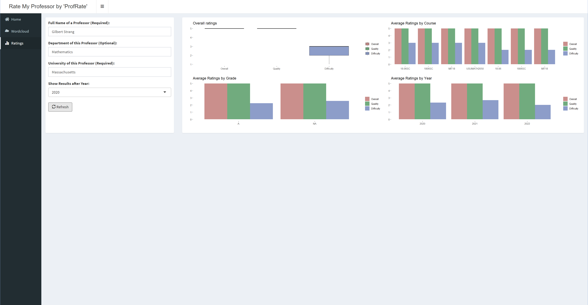

```{r, include = FALSE}
knitr::opts_chunk$set(
  collapse = TRUE,
  comment = "#>"
)
```


The homepage introduces the functionality of the `ProfRate` package.
Here, we will get into more details and its applications for those who are interested.


# Motivation
As a student, you might be interested to know more about a certain professor before registering for a course,
for example, an overall course quality, the difficulty level, and comments from previous students.
Luckily, the website [Rate My Professor](https://www.ratemyprofessors.com/) gathers various information on professors, and our `ProfRate` package will utilize them and assist the users to know their professors better at a glance.

This package mainly offers a user-friendly Shiny dashboard to visualize students' feedback on a specific professor of interest.
Users can also follow the examples and apply these powerful functions as helpers for other purposes.


# What is this package for?    
This package provides information and visualization on the following questions:

* What are the positive and negative words commented on a professor?
* What are the most frequently used positive and negative words?
* What are the overall rating, quality rating, and difficulty rating of a professor?
* Are the ratings of a professor differ among different courses?
* Do the ratings of a professor change over time?
* Do the grades of the students affect the ratings?
  

# Who can use this package?
* Students: 
  * Get more familiar with a professor by looking at the feedback of peer students for learning purposes.
* Professors:
  * Get constructive feedback on their strengths, weaknesses, and progress over time from students' point of view for self-evaluation purposes. 


# Functions

First, we have the following flowchart summarizing the relationship and dependence among all functions in this package:

```{r, echo = FALSE, fig.align='center'}

```

There are ten functions in total.
The first three functions in the green box generate the URL for the scraping procedure used in other functions.
The next seven functions in the blue box are the body of the package responsible for summarization and visualization.
The last one in the yellow box is used to launch the Shiny dashboard.

In short, firstly, a URL is generated using the professor's name, department, and university name.
Then the comments and ratings are scraped, summarized, and plotted.
All the outputs are then visualized in the Shiny dashboard.

All functions that drive webscrapping use the `polite` package, and we do try our very best to be ethical scrapers.
Let us know if there are any issues with using the website data, and we will modify it accordingly.


## `get_all_schools`

* This function finds the university's URL using its name.
* It can be used independently, and it is also used as a helper function to filter and find the professor of interest in the `get_tid` function.
* For future development, it can be used for campus evaluation as well.

Examples:

```{r setup}
library(ProfRate)
```

```{r}
get_all_schools('Iowa State University')
get_all_schools('MIT')
```


## `general_info`

* This function extracts general information on a professor.
* It takes a URL and extracts the professor's name, department, and university.
* It can be used independently, and it is also used as a helper function to filter and find the professor of interest in the `get_tid` function.

Examples:

```{r}
general_info("https://www.ratemyprofessors.com/ShowRatings.jsp?tid=342455")
general_info("https://www.ratemyprofessors.com/ShowRatings.jsp?tid=744853")
```


## `get_tid`

* This function extracts the professor's ID and combines it with general information.
* The name argument is required to be a full name and the university argument is also required. The department argument is optional.
* The function uses `rvest::html_text` to check nodes and regular expression to extract ids.


```{r}
get_tid(name = 'Brakor', university = 'California Berkeley')
get_tid(name = 'Brakor', department = 'Biology', university = 'Berkeley')
```


## `get_url`

* This function takes the same arguments as `get_tid`.
It assesses the tid(s) first and then generate the corresponding URL(s).
* With this function, we can use name, department, and university as direct inputs for further functions. The advantage is that we can restrict the number of scraping to the minimum - only scrape once and then use URL as input for the future.

Examples:


```{r}
get_url(name = 'Brakor', department = 'Biology', university = 'Berkeley')
```


## `comment_info`

* This function extracts the comments together with the year and course for a given URL.
* It also extracts the number of thumbs up and down for each comment.
* This function can filter the comments and only show those after a specific year.


```{r}
comment_info(url = "https://www.ratemyprofessors.com/ShowRatings.jsp?tid=1031282", y = 2000)
comment_info(url = "https://www.ratemyprofessors.com/ShowRatings.jsp?tid=1129448", y = 2000)
```


## `sentiment_info`

* This function does sentiment analysis on the comments and generates sets of _positive_ and _negative_ words with their number of occurrences.
* It can also show _tags_ from the website with the number of occurrences.
* User can decide which set of words/tags to show.
* It can filter from a certain year up to the present.

Example:

```{r}
sentiment_info(url = "https://www.ratemyprofessors.com/ShowRatings.jsp?tid=69792", y = 2009, word = 'Positive')
sentiment_info(url = "https://www.ratemyprofessors.com/ShowRatings.jsp?tid=69792", y = 2000, word = 'Negative')
sentiment_info(url = "https://www.ratemyprofessors.com/ShowRatings.jsp?tid=69792", y = 2009, word = 'Tags')
```


## sentiment_plot

* This function visualizes the output of the `sentiment_info` function using a word cloud.
* It can generate plots corresponding to _positive_ words, _negative_ words, and _tags_ , respectively.
* It can filter from a certain year up to the present.

Examples:

```{r}
sentiment_plot(url = "https://www.ratemyprofessors.com/ShowRatings.jsp?tid=69792", y = 2009, word = 'Positive')
```


## `ratings_info`

* Given the URL, it extracts and summarizes all rating information on an professor.
* It creates a list of three outputs:
  * a number of comments
  * a table including the year, course, quality, difficulty, and overall rating with some other information regarding the course or the student
  * a table of summary statistics of the above table.
  

Examples:

```{r}
ratings_info("https://www.ratemyprofessors.com/ShowRatings.jsp?tid=1129448", y=2009)
```


## `ratings_plot`

* Given the URL, it generates the visualization for the ratings.
* It creates four subplots:
  * one boxplot of all ratings
  * three barplots of average ratings by course, grade, and year
  
  
```{r}
ratings_plot("https://www.ratemyprofessors.com/ShowRatings.jsp?tid=1129448", y=2009)
```

## `runExample`

* The function is used to launch the Shiny dashboard.


# Testing
We included different tests for each function to make sure that they work properly as we expect.
The test coverage of the package is 98%.
The only function that is not tested is the `runExample` function, which is used to launch the Shiny dashboard.
Here is the set of things we checked for each function in general:

* Checking the data type
* Verifying the length of inputs and outputs
* Correct format of the URL
* Correct set of arguments
* Error messages from the input or output checks embedded in the functions
* Checking plot reproducibility


# Documentation
Each function is documented thoroughly. The set of information included in each function is as below:

* Name and description
* Usage
* Arguments and their definition
* Outputs and their definition
* Examples


# Website
The [website](https://m-fili.github.io/ProfRate/) is launched and includes references, examples, and other useful information like this vignette on how to use this package.


# Shiny dashboard
As introduced before, the `runExample` function is used to launch our well-designed Shiny dashboard.
The dashboard is highly comprehensive and user-friendly.
Most importantly, it utilizes and shows all the functionalities discussed so far in an interactive way.
We include some screenshots of the Shiny dashboard below.

```{r, echo = FALSE, fig.align='center'}

```

```{r, echo = FALSE, fig.align='center'}

```

```{r, echo = FALSE, fig.align='center'}

```

# Future Steps

Here are the future steps to make this package more comprehensive.

1. Adding campus evaluation to the analysis as well as the Shiny dashboard.

2. Incorporating correlation analysis and outlier detection:
  * Relation between the ratings and grades
  * Relation between the comments and grades

3. Incorporate likes and dislikes into the analysis to emphasize the value of comments.
